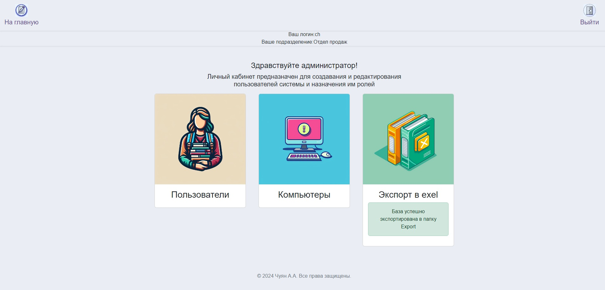

# Инвентарный учет

Приложение работает на фреймворке FastAPI предназначено для организованного сбора, группировки и представления сводных данных об используемых в организации компьютерной техники и пользователях, закрепленных за ней. Имеет систему аутентификации и разделения доступа к ресурсам, в зависимости от роли (администратор, пользователь, гость).

## Функционал

### Аутентификация


### Роль администратора
#### Создание и редактирование пользователей приложения

кабинет администратора

редактирование пользователя


#### Экспорт базы данных в Exel



### Роль ответственного за учет

#### Создание и редактирование пользователей подразделения


#### Создание и редактирование компьютерной техники подразделения


### Роль пользователя


## Запуск в консольном режиме

```bash
# Windows
# Напрямую с интерпретатора
python -m venv .venv
.\.venv\Scripts\activate
pip install -r requirements.txt
cd .\src\
python main.py

#Linux
python3 -m venv .venv
source .venv/bin/activate
pip install -r requirements.txt
cd .\src\
python main.py


# Контейнер Docker
docker build -t app-inventory .
docker run -d -p 80:8000 app-inventory 

    ## для удаления
    docker stop app-inventory 
    docker rm -f app-inventory

# Docker-Compose
docker-compose up
    # запуск в фоне
    docker-compose up -d
    # удаление
    docker-compose down

```
