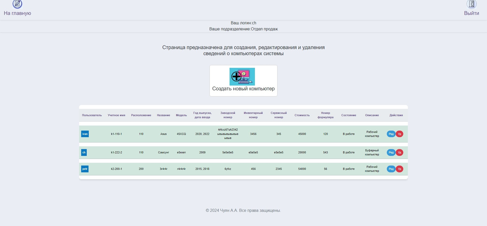

# Инвентарный учет

Приложение работает на фреймворке FastAPI предназначено для организованного сбора, группировки и представления сводных данных об используемых в организации компьютерной техники и пользователях, закрепленных за ней. Имеет систему аутентификации и разделения доступа к ресурсам, в зависимости от роли (администратор, пользователь, гость).

## Функционал

### Аутентификация


### Роль администратора

#### Создание и редактирование пользователей приложения

кабинет администратора

редактирование пользователя


#### Экспорт базы данных в Exel


### Роль пользователя

#### Создание и редактирование пользователей подразделения


#### Создание и редактирование компьютерной техники подразделения


## Запуск в консольном режиме

```bash

```


