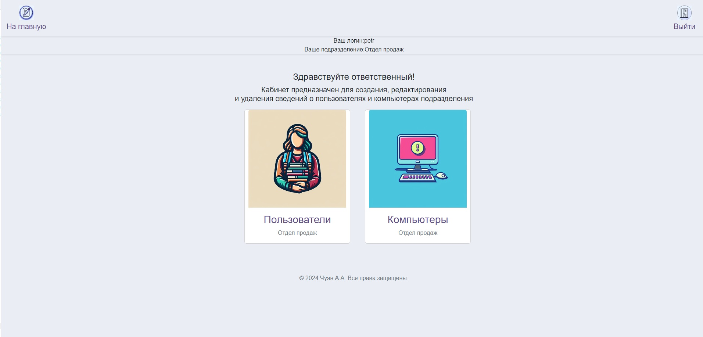
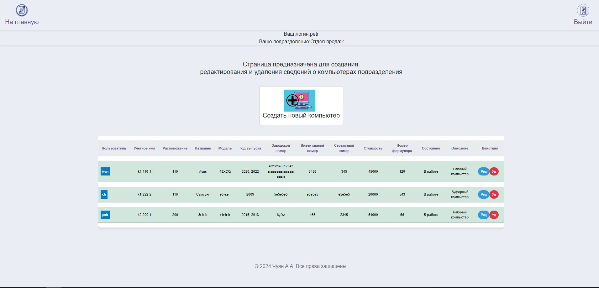

# Инвентарный учет

Приложение работает на фреймворке FastAPI предназначено для организованного сбора, группировки и представления сводных данных об используемых в организации компьютерной техники и пользователях, закрепленных за ней. Имеет систему аутентификации и разделения доступа к ресурсам, в зависимости от роли (администратор, пользователь, гость).

## Функционал

### Аутентификация


### Роль администратора
#### Создание и редактирование пользователей приложения

кабинет администратора

редактирование пользователя


#### Экспорт базы данных в Exel


### Роль ответственного за учет

#### Создание и редактирование пользователей подразделения


#### Создание и редактирование компьютерной техники подразделения



### Роль пользователя


## Запуск в консольном режиме

```bash
# Подготовка
# в директории main создайте файл окружения .env с содержимым секретного ключа для генерации токена
echo "" > ./src/.env
SECRET_KEY=*******

mkdir db
mkdir export
# запуск
# Windows
# Напрямую с интерпретатора
# создание окружения
python -m venv .venv
# переход в окружение
.\.venv\Scripts\activate
python.exe -m pip install --upgrade pip
pip install -r requirements.txt
# pip freeze > requirements.txt # для записей завиимостей 
# deactivate # выход из виртуального окружения

# запуск
cd .\src\
python main.py

#Linux
python3 -m venv .venv
source .venv/bin/activate
pip install -r requirements.txt
cd .\src\
python main.py


# Контейнер Docker
docker build -t app-inventory .
docker run -d -p 80:8000 app-inventory 

    ## для удаления
    docker stop app-inventory 
    docker rm -f app-inventory

# Docker-Compose
docker-compose up
    # запуск в фоне
    docker-compose up -d
    # удаление
    docker-compose down

```

# Просмотр логов
sudo tail -f /var/log/python_app_inventory.log


# Promethus метрики
```bash
python_info
get_auth_requests_total         # число реквестов главной страницы
get_auth_requests_error_total   # число реквестов ошибок авторизации
get_logout_requests_total       # число реквестов выхода из приложения
get_workers_requests_total      # число запросов к пользователям
get_arms_requests_total         # число запросов к армам

worker_create_total             # число созданных пользователей
arm_create_total                # число созданных пользователей

rate(get_auth_requests_total{}[20m])             # Частота запросов в течение 5 минут
rate(get_auth_requests_error_total{}[20m])       # Частота ошибок авторизации
rate(worker_create_total{}[20m])                 # Частота создания пользователей
rate(arm_create_total{}[20m])                    # Частота создания армов

# Graphana дашборды 
FA_inv/Инвентарный учет-1725356679506.json